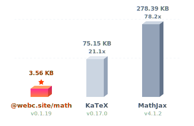
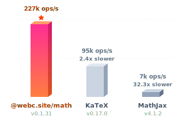
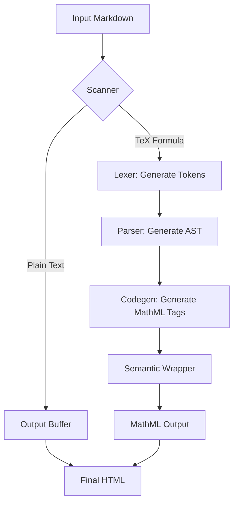
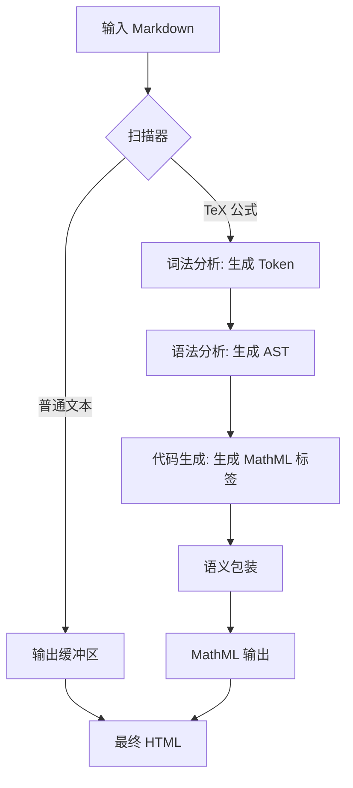

[English](#en) | [中文](#zh)

---

<a id="en"></a>

# @webc.site/math

### The world's smallest and fastest web Markdown formula renderer

<a href="https://www.npmjs.com/package/@webc.site/math" target="_blank"></a>
&nbsp;&nbsp;
<a href="https://github.com/webc-site/math" target="_blank"></a>
&nbsp;&nbsp;
<a href="https://math.webc.site" target="_blank"></a>

No need to load hundreds of KB of KaTeX/MathJax and large font packages. At just ~4KB (Gzipped), it compiles LaTeX equations into native MathML supported by modern browsers, achieving zero-overhead rendering.

- [Core Advantages](#core-advantages)
  - [What is MathML?](#what-is-mathml)
  - [Why Compile TeX Formulas to MathML?](#why-compile-tex-formulas-to-mathml)
- [Benchmark](#benchmark)
  - [1. Size Comparison (Gzipped)](#1-size-comparison-gzipped)
  - [2. Generation Speed (Ops/sec)](#2-generation-speed-opssec)
- [Usage](#usage)
  - [JavaScript Examples](#javascript-examples)
  - [CSS and Math Font Configuration](#css-and-math-font-configuration)
  - [Markdown Parser Plugins](#markdown-parser-plugins)
- [Features](#features)
- [Supported Syntax List](#supported-syntax-list)
- [Unsupported Syntax](#unsupported-syntax)
- [Error Handling and Fault Tolerance](#error-handling-and-fault-tolerance)
  - [Internal Error Codes](#internal-error-codes)
- [Design and Workflow](#design-and-workflow)
  - [Module Stages](#module-stages)
- [Adding New Syntax](#adding-new-syntax)
  - [1. Constant Definitions](#1-constant-definitions)
  - [2. Lexer](#2-lexer)
  - [3. Parser](#3-parser)
  - [4. Codegen](#4-codegen)
- [Tech Stack](#tech-stack)
- [Directory Structure](#directory-structure)
- [Historical Background](#historical-background)

## Core Advantages

### What is MathML?

MathML (Mathematical Markup Language) is an XML-based standard for describing math formulas on the Web.
Since January 2023 (following Chrome 109's native support for MathML Core), all major browser engines (Blink, Gecko, WebKit) natively support MathML. Pages can render formulas without loading third-party JavaScript layout libraries.

### Why Compile TeX Formulas to MathML?

While MathML renders natively, its XML-based syntax is too verbose for direct writing. TeX remains the standard for authoring formulas (e.g., `$e^{i\pi} + 1 = 0$`).
Traditional solutions (like MathJax or KaTeX) require loading hundreds of KB of JS/CSS layout engines and consume CPU for DOM calculations.
`@webc.site/math` compiles TeX to MathML, offering several advantages for Client-Side Rendering (CSR):

- **Lightweight**: Only 7.78 KB raw size (3.58 KB gzipped), with zero footprint on initial page load times.
- **Zero Runtime Dependencies**: Performs translation at compile time, delegating all rendering, positioning, and layout to the browser's native C++ engine. No JS layout engine runs on the client.
- **Low CPU Overhead**: Designed for high-frequency rendering scenarios like WYSIWYG editors, running smoothly even on low-end mobile devices.
- **SSR-Friendly**: Outputs standard HTML MathML tags, working identically for client-side dynamic rendering or static server-side building (SSR/SSG).

## Benchmark

### 1. Size Comparison (Gzipped)

| Library                                                     | Raw Size  | Gzip Size | Size Ratio |
| :---------------------------------------------------------- | :-------: | :-------: | :--------: |
| [@webc.site/math](https://github.com/webc-site/math) (Ours) |  7.78 KB  |  3.58 KB  |   1.0 ⭐️   |
| [KaTeX](https://github.com/KaTeX/KaTeX)                     | 264.79 KB | 75.15 KB  |    21.0    |
| [MathJax](https://github.com/mathjax/MathJax)               | 971.04 KB | 278.39 KB |    77.7    |



### 2. Generation Speed (Ops/sec)

Based on compiling standard test equations (measured using [sh/bench/pk.js](https://github.com/webc-site/math/blob/dev/sh/bench/pk.js)):

- **@webc.site/math (Ours)**: ~329,000 ops/s (1.0 ⭐️)
- **[KaTeX](https://github.com/KaTeX/KaTeX)**: ~92,000 ops/s (~3.6x slower)
- **[MathJax](https://github.com/mathjax/MathJax)**: ~6,700 ops/s (~48.8x slower)



## Usage

### JavaScript Examples

#### 1. Render TeX Formulas Directly

Use `@webc.site/math` to compile TeX formulas directly into MathML (ideal for Markdown parser plugins):

```javascript
import mathml from "@webc.site/math";

const tex = "e^{i\\pi} + 1 = 0";
const html = mathml(tex, true); // true for block math, false/empty for inline math
```

#### 2. Replace Formulas in Markdown

Use `@webc.site/math/md.js` to automatically detect and replace inline/block formulas in Markdown text with MathML (requires passing the math compiler):

```javascript
import mdMath from "@webc.site/math/md.js";
import compile from "@webc.site/math";

const markdown = "Euler's identity: $$e^{i\\pi} + 1 = 0$$";
const html = mdMath(markdown, compile);

console.log(html);
// Output: Euler's identity: <math xmlns="http://www.w3.org/1998/Math/MathML" display="block"><semantics><mrow><msup><mi>e</mi><mrow><mi>i</mi><mi>π</mi></mrow></msup><mo>+</mo><mn>1</mn><mo>=</mo><mn>0</mn></mrow><annotation encoding="application/x-tex">e^{i\pi} + 1 = 0</annotation></semantics></math>
```

### CSS and Math Font Configuration

To ensure beautifully typeset browser-native math equations, using a math font is recommended. We recommend the **Latin Modern Math** font from the `18s` package (derived from Donald Knuth's classical Computer Modern, supporting OpenType MATH table features).

#### 1. Online Reference (Recommended)

Import the online font in CSS:

```css
/* Import the bundle (includes Source Han Sans t, monospace c, and math font m) */
@import url("//registry.npmmirror.com/18s/0.2.24/files/_.css");
```

Or import the math font `m` only:

```css
@import url("//registry.npmmirror.com/18s/0.2.24/files/m.css");
```

#### 2. Configure CSS Style

Set the font family for the `math` tag in your global CSS stylesheet.

##### Option A: Using Online Fonts (Recommended for best visual quality)

For projects importing the `18s` font assets (which contains the optimized math font `m` and Source Han Sans `t`):

```css
math {
  /* m is the math font, t is Source Han Sans (optimized with font slicing for Chinese characters to boost loading performance), math is system math font, sans-serif is default fallback */
  font-family: m, t, math, sans-serif;
}
```

##### Option B: Using System Math Fonts (Zero external font assets)

Leverage system-default math fonts to minimize loading size:

```css
math {
  /* Prioritize system-built-in math fonts, fallback to standard CSS 'math' generic font family, and use sans-serif as a final fallback */
  font-family: "STIX Two Math", "Latin Modern Math", "Cambria Math", math, sans-serif;
}
```

#### 3. Integration with Build Tools

Install the `18s` font package via npm, and import it at your project entry using build tools like Vite or Webpack:

```bash
npm install 18s
```

Import font styles in your project entry file:

##### Method A: Import in JS/TS Entry File

```javascript
// Import the bundle (includes Source Han Sans t, monospace c, and math font m)
import "18s/_.css";
```

Or import math font `m` only:

```javascript
import "18s/m.css";
```

##### Method B: Import in CSS Stylesheet

```css
/* Import the bundle (includes Source Han Sans t, monospace c, and math font m) */
@import "18s/_.css";
```

Or import math font `m` only:

```css
@import "18s/m.css";
```

### Markdown Parser Plugins

#### 1. Marked Extension

Use [`@webc.site/math-marked`](https://www.npmjs.com/package/@webc.site/math-marked) to automatically parse and compile inline (`$...$`) and block (`$$...$$`) formulas:

```javascript
import { marked } from "marked";
import mathMarked from "@webc.site/math-marked";

marked.use(mathMarked());

const html = marked.parse("Euler's identity: $$e^{i\\pi} + 1 = 0$$");
```

#### 2. Remark Plugin

Use [`@webc.site/math-remark`](https://www.npmjs.com/package/@webc.site/math-remark) to replace `inlineMath` and `math` nodes in Unified/Remark AST with native MathML HTML:

```javascript
import { unified } from "unified";
import remarkParse from "remark-parse";
import remarkMath from "remark-math";
import mathRemark from "@webc.site/math-remark";
import remarkHtml from "remark-html";

const html = await unified()
  .use(remarkParse)
  .use(remarkMath)
  .use(mathRemark)
  .use(remarkHtml, { sanitize: false })
  .process("Euler's identity: $$e^{i\\pi} + 1 = 0$$");
```

#### 3. Markdown-it Plugin

Use [`@webc.site/math-markdown-it`](https://www.npmjs.com/package/@webc.site/math-markdown-it) to automatically parse and render inline/block formulas in `markdown-it`:

```javascript
import markdownit from "markdown-it";
import mathMarkdownIt from "@webc.site/math-markdown-it";

const md = markdownit().use(mathMarkdownIt);

const html = md.render("Euler's identity: $$e^{i\\pi} + 1 = 0$$");
```

## Features

- **Highly Complete**: Successfully compiles thousands of math formulas from KaTeX/MathJax official test suites (see [extract](https://github.com/webc-site/math/tree/dev/extract)).
- **Fault-Tolerant**: Syntax errors (such as unclosed `\left`/`\right`) are automatically caught and degraded to display raw TeX code, preventing application crashes.
- **Fast Compiler**: Compiles TeX formulas directly to semantic MathML without external parser dependencies.
- **Markdown Integration**: Automatically parses inline math (`$formula$`) and block math (`$$formula$$`) in Markdown text.
- **Standard Compatibility**: Outputs valid MathML elements supported natively by modern browsers.

## Supported Syntax List

Designed to be extremely lightweight, this library supports the most commonly used math typesetting syntaxes:

- **Basic Arithmetic & Symbols**: Numbers, English letters, basic operators (`+`, `-`, `*`, `/`, `=`, `<`, `>`, `(`, `)`, `[`, `]`, `.`). Note that `-` automatically maps to minus sign `\u2212`, `*` maps to asterisk `\u2217`, and `/` is rendered in upright normal font.
- **Subscripts & Superscripts**:
  - Superscript `^` (e.g., `x^2`)
  - Subscript `_` (e.g., `x_i`)
  - Both subscripts and superscripts (e.g., `x_i^2` or `x^2_i`)
  - Subscripts/superscripts of sum, integration, and other big operators will automatically appear in limits form (e.g., `\sum_{i=1}^n`, `\int_a^b`)
- **Fractions**: `\frac{numerator}{denominator}` (e.g., `\frac{a}{b}`)
- **Roots**: Square root `\sqrt{x}` and $n$-th root `\sqrt[n]{x}`
- **Overlines & Bars**: `\overline{x}` and the shorthand `\bar{x}`
- **Delimiters & Brackets**: `\left` and `\right` structures (e.g., `\left( ... \right)`). Supported delimiters include:
  - Parentheses: `(` and `)`
  - Square brackets: `[` and `]`
  - Braces: `\{` and `\}`
  - Angle brackets: `<` and `>`
  - Vertical bars: `|` or `\|`
  - Empty delimiter: `.` (hides the delimiter on that side, e.g., `\left. \frac{df}{dx} \right| _0`)
- **Text Mode**: `\text{...}` (e.g., `\text{if }`), extracts literal text inside braces and renders it as MathML `<mtext>` in normal upright font.
- **Horizontal Spacing**: Supports `\quad` (1em spacing) and `\qquad` (2em spacing).
- **Styles, Strikethroughs & Phantom**:
  - Border: `\boxed{...}` (adds a border around the formula, e.g., `\boxed{x+y}`)
  - Strikethroughs: `\cancel{...}` (strikes through with a slash, e.g., `\cancel{x}`) and `\sout{...}` (strikes through with a horizontal line, e.g., `\sout{y}`)
  - Hiding & Spacing: `\phantom{...}` (creates an invisible space with the same width and height, e.g., `\phantom{x}`)
- **Common Functions**: `\sin`, `\cos`, `\tan`, `\cot`, `\sec`, `\csc`, `\log`, `\lg`, `\ln`, `\lim`, `\exp`, `\max`, `\min`, `\sup`, `\inf`, `\det`, `\gcd`, `\arcsin`, `\arccos`, `\arctan`, `\sinh`, `\cosh`, `\tanh`, `\coth`, `\deg`, `\arg`. Subscripts/superscripts of limit-like operators (`\lim`, `\max`, `\min`, `\sup`, `\inf`) appear as limits (directly below/above) in display mode.
- **Modulo**: `\pmod{...}` (adds a modulo parenthesis, e.g., `\pmod{m}` renders as $(mod\ m)$)
- **Greek Letters**:
  - Lowercase: `\alpha` ($\alpha$), `\beta` ($\beta$), `\gamma` ($\gamma$), `\delta` ($\delta$), `\epsilon` ($\epsilon$), `\zeta` ($\zeta$), `\eta` ($\eta$), `\theta` ($\theta$), `\iota` ($\iota$), `\kappa` ($\kappa$), `\lambda` ($\lambda$), `\mu` ($\mu$), `\nu` ($\nu$), `\xi` ($\xi$), `\pi` ($\pi$), `\rho` ($\rho$), `\sigma` ($\sigma$), `\tau` ($\tau$), `\upsilon` ($\upsilon$), `\phi` ($\phi$), `\chi` ($\chi$), `\psi` ($\psi$), `\omega` ($\omega$)
  - Uppercase (rendered in normal upright font): `\Delta` ($\Delta$), `\Gamma` ($\Gamma$), `\Theta` ($\Theta$), `\Lambda` ($\Lambda$), `\Xi` ($\Xi$), `\Pi` ($\Pi$), `\Sigma` ($\Sigma$), `\Upsilon` ($\Upsilon$), `\Phi` ($\Phi$), `\Psi` ($\Psi$), `\Omega` ($\Omega$)
- **Operators & Relations**:
  - `\le` / `\leq` ($\le$), `\ge` / `\geq` ($\ge$), `\ne` / `\neq` ($\ne$)
  - `\cdot` ($\cdot$), `\times` ($\times$), `\pm` ($\pm$), `\mp` ($\mp$), `\div` ($\div$), `\infty` ($\infty$)
  - `\approx` ($\approx$), `\sim` ($\sim$), `\cong` ($\cong$), `\propto` ($\propto$), `\equiv` ($\equiv$), `\perp` ($\perp$), `\parallel` ($\parallel$)
- **Calculus, Sets & Logic**:
  - Gradient: `\nabla` ($\nabla$), partial differential: `\partial` ($\partial$)
  - Quantifiers & operations: `\forall` ($\forall$), `\exists` ($\exists$), `\neg` ($\neg$), `\land` ($\land$), `\lor` ($\lor$)
  - Set relations: `\in` ($\in$), `\notin` ($\notin$), `\ni` ($\ni$), `\subset` ($\subset$), `\supset` ($\supset$), `\subseteq` ($\subseteq$), `\supseteq` ($\supseteq$)
  - Set operations: `\cup` ($\cup$), `\cap` ($\cap$), empty set: `\emptyset` ($\emptyset$)
  - Special variables & constants: `\ell` ($\ell$), `\hbar` ($\hbar$)
  - Large operators: summation `\sum` ($\sum$), integration `\int` ($\int$)
- **Arrows**:
  - Single arrows: `\to` / `\rightarrow` ($\rightarrow$), `\leftarrow` / `\gets` ($\leftarrow$), `\Leftarrow` ($\Leftarrow$), `\Rightarrow` ($\Rightarrow$)
  - Double arrows: `\leftrightarrow` ($\leftrightarrow$), `\Leftrightarrow` ($\Leftrightarrow$)
- **Dots**:
  - Baseline dots: `\dots` / `\ldots` ($\dots$)
  - Centered dots: `\cdots` ($\cdots$)
- **Matrices & Multi-line Layouts**:
  - Matrix environments: `matrix`, `pmatrix`, `bmatrix`, `vmatrix`, `Vmatrix` (e.g., `\begin{pmatrix} a & b \\ c & d \end{pmatrix}`)
  - Cases: `cases` (e.g., `\begin{cases} x & x \ge 0 \\ -x & x < 0 \end{cases}`)
  - General arrays: `array`
  - Line breaks & alignment: Use `\\`, `\\*` or `\\[width]` (e.g., `\\[10px]`) for line breaks, and `&` for column alignment.

## Unsupported Syntax

Currently, the following LaTeX extensions, macros, or fine-tuning style directives are not supported:

1. **Macro Definitions**: `\newcommand`, `\renewcommand`, `\providecommand`, `\gdef`, `\let`, etc.
2. **Background Colors & Advanced Borders**: `\colorbox`, `\fcolorbox`, `\cellcolor`, etc. (while `\boxed` is supported).
3. **Other Strikethroughs**: `\bcancel`, `\xcancel`, etc. (while `\cancel` and `\sout` are supported).
4. **Advanced Layouts & Spacing**: `\hphantom`, `\vphantom`, `\smash`, etc. (while `\phantom` is supported).
5. **Chemistry Package Extensions**: Chemical formula macros like `\ce{...}` (mhchem).
6. **Verbatim Text**: `\verb`, etc.
7. **Advanced Positionings**: `\sideset`, `\prescript`, `\cramped`, `\flatfrac`, etc.
8. **Equation Numbering & Custom Tags**: `\tag`, `\newtagform`, `\usetagform`, etc.
9. **Arbitrary Operator Limits**: Except for predefined big operators (`\sum`, `\int`) and limit-like operators (`\lim`), using `\limits` on arbitrary commands or structures is not supported.

## Error Handling and Fault Tolerance

When parsing Markdown text using `@webc.site/math/md.js`, syntax errors (such as an unclosed `\left`) are automatically caught and degraded to display raw TeX code (e.g., `$$x + \left( y$$`), without throwing JS exceptions. Therefore, you **do not** need to wrap it in a `try...catch` block.

If you call the compiler core `@webc.site/math` directly with invalid LaTeX, it will throw an array containing an error code (see table below). Wrap direct core compiler calls in a `try...catch` block.

### Internal Error Codes

| Error Code | Constant            | Description                                   | Trigger Example                       |
| :--------: | :------------------ | :-------------------------------------------- | :------------------------------------ |
|    `0`     | `ERR_EXTRA_END`     | Extra or invalid `\end` command               | `\end{matrix}` (no matching `\begin`) |
|    `1`     | `ERR_MISSING_RIGHT` | `\left` delimiter missing a matching `\right` | `\left( x`                            |
|    `2`     | `ERR_EXTRA_RIGHT`   | Extra or invalid `\right` command             | `x \right)` (no matching `\left`)     |
|    `3`     | `ERR_MISSING_BRACE` | Command missing required curly brace `{}`     | `\text x` (missing braces)            |

## Design and Workflow

The parser processes the input Markdown string, isolates TeX expressions, and translates them into MathML structures.



### Module Stages

1. **Scanner**: Scans the input string to locate formula delimiters (`$` and `$$`).
2. **Lexer**: Breaks the TeX string into tokens like numbers, variables, operators, and control commands.
3. **Parser**: Translates tokens into an Abstract Syntax Tree (AST), supporting operations like subscripts, superscripts, fractions, and built-in functions.
4. **Codegen**: Maps AST nodes to standard MathML Core elements (`<mi>`, `<mo>`, `<mn>`, `<mfrac>`, `<msup>`, `<msub>`, `<msubsup>`).

## Adding New Syntax

To add support for a new LaTeX command, modify the following four core parts in order:

### 1. Constant Definitions

Define the corresponding lexical token, AST node type, function name, or symbol mapping:

- **Token Type**: Defined in [const/TOK.js](https://github.com/webc-site/math/blob/dev/src/const/TOK.js) (e.g., `export const TOK_MY_CMD = ...`).
- **AST Node Type**: Defined in [const/TYPE.js](https://github.com/webc-site/math/blob/dev/src/const/TYPE.js) (e.g., `export const TYPE_MY_NODE = ...`).
- **Environment Delimiters**: If adding a new environment (like a matrix or bracket type), configure its left and right delimiters in `ENV_DELIMS` inside [mathml.js](https://github.com/webc-site/math/blob/dev/src/mathml.js).
- **Symbol Mapping**: For simple operators or symbols, map the command name to its Unicode character in `SYM_MAP` inside [const/SYM.js](https://github.com/webc-site/math/blob/dev/src/const/SYM.js).
- **Math Function Name**: Define in `FUNC_NAMES` inside [const/FUNC.js](https://github.com/webc-site/math/blob/dev/src/const/FUNC.js).

### 2. Lexer

The `lex(str)` function cuts the input LaTeX string into a token array. It is located in [lex.js](https://github.com/webc-site/math/blob/dev/src/lex.js).

- If introducing a new special character or structure, update character matching logic in `lex` to push the correct `TOK_*` type and its literal value to the `tokens` array.

### 3. Parser

The `parse(tokens, state)` function translates tokens into AST nodes. It is located in [parse.js](https://github.com/webc-site/math/blob/dev/src/parse.js).

- **Command Parsing**: Handled primarily inside the `TOK_MAP[TOK_CMD]` function. When matching your command (e.g., `\mycmd`), read its arguments (using `read(tokens, state_ref)` or `grab(tokens, state_ref)`) and return the node array: `[TYPE_MY_NODE, arg1, arg2]`.

### 4. Codegen

The `SHOW_MAP` dictionary maps AST nodes to standard MathML markup strings. It is located in [mathml.js](https://github.com/webc-site/math/blob/dev/src/mathml.js).

- Register a renderer function: `[TYPE_MY_NODE]: ([_, arg1, arg2]) => nest("mylabel", arg1, arg2)`, formatting node data into native MathML tags.

## Tech Stack

- **Runtime**: Bun, Node.js
- **Build & Bundle**: SWC (compression), Vite (demo site)
- **Quality Assurance**: oxlint, oxfmt

## Directory Structure

```
.
├── demo/                # Interactive demo site
│   ├── const/           # Constants (preset formulas, language list)
│   ├── i18n/            # Language translation configurations
│   ├── index.js         # Interactive demo logic
│   ├── index.pug        # Pug HTML template
│   └── style.styl       # Styling and themes
├── extract/             # Test case extraction scripts (from KaTeX / MathJax)
├── lib/                 # Compilation output directory
│   ├── package.json     # Lightweight package.json for npm publication
│   ├── README.md        # Automatically generated distribution README
│   ├── mathml.js        # Minified core TeX compiler
│   ├── mathml.js.map    # Source map for mathml.js
│   ├── md.js            # Minified Markdown parser
│   └── md.js.map        # Source map for md.js
├── src/                 # Source code
│   ├── const/           # Tokens, AST types, symbol maps, and function names
│   ├── lex.js           # LaTeX lexer
│   ├── parse.js         # LaTeX parser (AST generation)
│   ├── mathml.js        # TeX-to-MathML compiler
│   └── md.js            # Markdown mathematical formula parser
├── sh/                  # Scripts
│   ├── bench/           # Benchmark scripts, charts, and historical baseline data
│   │   ├── pk.js        # Size and speed comparison & chart generation
│   │   ├── self.js      # Regression tests
│   │   ├── util.js      # Shared helpers
│   │   ├── chart.js     # SVG chart component
│   │   └── history.yml  # YAML historical benchmark records
│   └── check.js         # Language file validation script
├── dev.js               # Dev server script (Vite)
├── dist.js              # Publish helper script (versioning and template rendering)
├── minify.js            # Bundle compression script
├── package.json         # Project package config
├── README.md            # Automatically generated root README
├── README.mdt           # Compilation template for README
└── test.sh              # Formatting, linting, and unit test execution script
```

## Historical Background

Web-based math formula rendering traditionally relied on MathJax or KaTeX. These libraries load large JS/CSS packages and perform complex client-side calculations, causing noticeable loading delay or page layout shifting.

MathML Core specifies native mathematical typesetting in the browser. In 2023, the Blink engine introduced native support, enabling Chrome, Safari, and Firefox to natively lay out equations.

In combination with the **Latin Modern Math** font (`m` from `18s` package), `@webc.site/math` acts as a translator, compiling TeX equations directly to native MathML Core tags to eliminate client-side rendering engines.

---

<a id="zh"></a>

# @webc.site/math

### 全球最小最快的网页 Markdown 公式渲染器

<a href="https://www.npmjs.com/package/@webc.site/math" target="_blank"></a>
&nbsp;&nbsp;
<a href="https://github.com/webc-site/math" target="_blank"></a>
&nbsp;&nbsp;
<a href="https://math.webc.site" target="_blank"></a>

无需引入数百 KB 的 KaTeX/MathJax 及庞大的字体包。包体积仅约 4KB (Gzip)，将 LaTeX 公式编译为浏览器原生支持的 MathML，实现零运行开销的公式渲染。

- [核心优势](#核心优势)
  - [什么是 MathML？](#什么是-mathml)
  - [为什么将 TeX 编译为 MathML？](#为什么将-tex-编译为-mathml)
- [性能对比](#性能对比)
  - [1. 体积对比（Gzip 压缩）](#1-体积对比gzip-压缩)
  - [2. 生成速度对比](#2-生成速度对比)
- [使用方法](#使用方法)
  - [JavaScript 示例](#javascript-示例)
  - [CSS 与数学字体配置](#css-与数学字体配置)
  - [Markdown 解析器插件](#markdown-解析器插件)
- [功能特性](#功能特性)
- [支持的语法清单](#支持的语法清单)
- [不支持的语法](#不支持的语法)
- [错误处理与容错机制](#错误处理与容错机制)
  - [内部错误码](#内部错误码)
- [设计思路与调用流程](#设计思路与调用流程)
  - [模块运行流程](#模块运行流程)
- [如何添加新语法](#如何添加新语法)
  - [1. 常量定义](#1-常量定义)
  - [2. 词法分析](#2-词法分析)
  - [3. 语法分析](#3-语法分析)
  - [4. 代码渲染](#4-代码渲染)
- [技术堆栈](#技术堆栈)
- [目录结构](#目录结构)
- [历史背景](#历史背景)

## 核心优势

### 什么是 MathML？

MathML（数学标记语言）是描述数学公式结构与语义的 XML 标准。
自 Chrome 109（2023年1月）起，所有主流浏览器引擎（Blink、Gecko、WebKit）均已原生支持 MathML Core 标准。页面无需加载 JS 排版库即可渲染公式。

### 为什么将 TeX 编译为 MathML？

MathML 语法基于 XML，不便于直接书写。日常书写的公式标准是 TeX 语法（如 `$e^{i\pi} + 1 = 0$`）。
传统库（如 MathJax、KaTeX）在前端运行时，需加载数百 KB 的排版引擎，并消耗 CPU 进行布局计算。
本库将 TeX 直接编译为 MathML，具有以下优势：

- **体积小**：包体积仅 7.78 KB（Gzip 3.58 KB），不影响首屏加载。
- **零运行依赖**：仅在编译期进行标签翻译，排版布局完全由浏览器底层的 C++ 原生引擎渲染，无需前端 JS 引擎介入，释放主线程。
- **低 CPU 开销**：适用于编辑器实时预览等高频渲染场景，低配移动设备运行流畅。
- **前后端通用**：输出标准 MathML 元素，适用于前端动态转换与服务端静态编译（SSR/SSG）。

## 性能对比

### 1. 体积对比（Gzip 压缩）

| 库                                                          | 原始体积  | Gzip 体积 | 尺寸比 |
| :---------------------------------------------------------- | :-------: | :-------: | :----: |
| [@webc.site/math](https://github.com/webc-site/math) (本库) |  7.78 KB  |  3.58 KB  | 1.0 ⭐️ |
| [KaTeX](https://github.com/KaTeX/KaTeX)                     | 264.79 KB | 75.15 KB  |  21.0  |
| [MathJax](https://github.com/mathjax/MathJax)               | 971.04 KB | 278.39 KB |  77.7  |


### 2. 生成速度对比

基于经典公式循环编译测试（使用 [sh/bench/pk.js](https://github.com/webc-site/math/blob/dev/sh/bench/pk.js) 测得）：

- **@webc.site/math (本库)**: ~329,000 ops/s (1.0 ⭐️)
- **[KaTeX](https://github.com/KaTeX/KaTeX)**: ~92,000 ops/s (约 3.6x 较慢)
- **[MathJax](https://github.com/mathjax/MathJax)**: ~6,700 ops/s (约 48.8x 较慢)


## 使用方法

### JavaScript 示例

#### 1. 直接渲染 TeX 公式

使用 `@webc.site/math` 将 TeX 公式编译为 MathML（适用于 Markdown 渲染插件开发）：

```javascript
import mathml from "@webc.site/math";

const tex = "e^{i\\pi} + 1 = 0";
const html = mathml(tex, true); // 第二个参数传 true 表示块级公式，传 false 或不传表示行内公式
```

#### 2. 替换 Markdown 中的公式

使用 `@webc.site/math/md.js` 自动识别 Markdown 文本中的行内/块级公式并替换为 MathML（需传入公式编译器）：

```javascript
import mdMath from "@webc.site/math/md.js";
import compile from "@webc.site/math";

const markdown = "欧拉恒等式：$$e^{i\\pi} + 1 = 0$$";
const html = mdMath(markdown, compile);

console.log(html);
// 输出: 欧拉恒等式：<math xmlns="http://www.w3.org/1998/Math/MathML" display="block"><semantics><mrow><msup><mi>e</mi><mrow><mi>i</mi><mi>π</mi></mrow></msup><mo>+</mo><mn>1</mn><mo>=</mo><mn>0</mn></mrow><annotation encoding="application/x-tex">e^{i\pi} + 1 = 0</annotation></semantics></math>
```

### CSS 与数学字体配置

为保证浏览器原生数学公式的排版，建议配置数学字体。推荐使用 `18s` 字体包的 **Latin Modern Math**（源自高德纳的 Computer Modern 字体，支持 OpenType 数学排版特性）。

#### 1. 在线引用

在 CSS 中通过 `@import` 引入在线字体：

```css
/* 引入合并后的字体 CSS（包含思源黑体 t、代码字体 c 及数学字体 m） */
@import url("//registry.npmmirror.com/18s/0.2.24/files/_.css");
```

或者仅按需引入数学字体 `m`：

```css
@import url("//registry.npmmirror.com/18s/0.2.24/files/m.css");
```

#### 2. 配置 CSS 样式

在全局 CSS 样式表中，为 `math` 标签指定数学字体。

##### 方案 A：使用在线字体（推荐，效果最完美）

引入 `18s` 提供的字体包（含切片优化思源黑体 `t` 与数学字体 `m`）：

```css
math {
  /* m 为数学字体，t 为思源黑体（对中文字符进行了切片优化以提升加载性能），math 为系统数学字体，sans-serif 为系统默认无衬线字体 */
  font-family: m, t, math, sans-serif;
}
```

##### 方案 B：使用系统数学字体（免引入外部资源）

直接使用系统内置数学字体以最小化体积：

```css
math {
  /* 优先使用各平台内置的数学字体，其次降级到 CSS 标准 math 泛型，最后以系统默认无衬线字体作为后备 */
  font-family: "STIX Two Math", "Latin Modern Math", "Cambria Math", math, sans-serif;
}
```

#### 3. 配合构建工具引用

通过 npm 安装 `18s` 字体包，配合 Vite、Webpack 等构建工具在项目入口中引入：

```bash
npm install 18s
```

在项目入口文件中引入字体样式：

##### 方式 A：在 JS/TS 入口中引入

```javascript
// 引入合并后的字体 CSS（包含思源黑体 t、代码字体 c 及数学字体 m）
import "18s/_.css";
```

或者仅按需引入数学字体 `m`：

```javascript
import "18s/m.css";
```

##### 方式 B：在 CSS 入口中引入

```css
/* 引入合并后的字体 CSS（包含思源黑体 t、代码字体 c 及数学字体 m） */
@import "18s/_.css";
```

或者仅按需引入数学字体 `m`：

```css
@import "18s/m.css";
```

### Markdown 解析器插件

#### 1. Marked 插件

使用 [`@webc.site/math-marked`](https://www.npmjs.com/package/@webc.site/math-marked) 自动解析并编译行内（`$...$`）与块级（`$$...$$`）公式：

```javascript
import { marked } from "marked";
import mathMarked from "@webc.site/math-marked";

marked.use(mathMarked());

const html = marked.parse("欧拉恒等式：$$e^{i\\pi} + 1 = 0$$");
```

#### 2. Remark 插件

使用 [`@webc.site/math-remark`](https://www.npmjs.com/package/@webc.site/math-remark) 将 Unified/Remark AST 中的 `inlineMath` 与 `math` 节点替换为原生 MathML HTML：

```javascript
import { unified } from "unified";
import remarkParse from "remark-parse";
import remarkMath from "remark-math";
import mathRemark from "@webc.site/math-remark";
import remarkHtml from "remark-html";

const html = await unified()
  .use(remarkParse)
  .use(remarkMath)
  .use(mathRemark)
  .use(remarkHtml, { sanitize: false })
  .process("欧拉恒等式：$$e^{i\\pi} + 1 = 0$$");
```

#### 3. Markdown-it 插件

使用 [`@webc.site/math-markdown-it`](https://www.npmjs.com/package/@webc.site/math-markdown-it) 自动解析并渲染 `markdown-it` 中的行内与块级公式：

```javascript
import markdownit from "markdown-it";
import mathMarkdownIt from "@webc.site/math-markdown-it";

const md = markdownit().use(mathMarkdownIt);

const html = md.render("欧拉恒等式：$$e^{i\\pi} + 1 = 0$$");
```

## 功能特性

- **功能完备**：通过数千个 KaTeX/MathJax 官方测试用例（详见 [extract](https://github.com/webc-site/math/tree/dev/extract)）。
- **健壮容错**：公式语法错误（如未闭合的 `\left`/`\right`）会自动捕获并降级显示原始公式，不抛出异常，防止应用崩溃。
- **快速编译**：无需外部依赖，直接将 TeX 公式编译为语义化 MathML。
- **Markdown 集成**：自动解析 Markdown 中的行内公式（`$ 公式 $`）和块级公式（`$$ 公式 $$`）。
- **标准兼容**：输出现代浏览器原生支持的标准 MathML 元素。

## 支持的语法清单

本库在极简的包体积下，支持最常用的数学公式排版语法：

- **基础算术与符号**：数字、英文字母、基础运算符（`+`, `-`, `*`, `/`, `=`, `<`, `>`, `(`, `)`, `[`, `]`, `.`）。其中 `-` 自动映射为减号 `\u2212`，`*` 映射为星号 `\u2217`，`/` 以直立体呈现。
- **上下标**：
  - 上标 `^`（如 `x^2`）
  - 下标 `_`（如 `x_i`）
  - 同时存在上下标（如 `x_i^2` 或 `x^2_i`）
  - 对于求和与积分等大型运算符，上下标会自动以限位上下标形式呈现（如 `\sum_{i=1}^n`，`\int_a^b`）
- **分式**：`\frac{分子}{分母}`（如 `\frac{a}{b}`）
- **开根号**：平方根 `\sqrt{x}` 以及 $n$ 次方根 `\sqrt[n]{x}`
- **上划线与横线**：`\overline{x}` 及简写形式 `\bar{x}`
- **自适应括号与定界符**：`\left` 和 `\right` 结构（如 `\left( ... \right)`）。支持的定界符包括：
  - 圆括号：`(` 和 `)`
  - 方括号：`[` 和 `]`
  - 花括号：`\{` 和 `\}`
  - 尖括号：`<` 和 `>`
  - 竖线：`|` 或 `\|`
  - 空白定界符：`.`（表示不显示该侧定界符，例如 `\left. \frac{df}{dx} \right| _0`）
- **文本模式**：`\text{...}`（如 `\text{if }`），提取大括号中的字面文本，渲染为 MathML `<mtext>`，以常规直立体呈现。
- **水平间距**：支持 `\quad`（1em 间距）和 `\qquad`（2em 间距）的空格占位。
- **样式、删除线与占位隐藏**：
  - 边框：`\boxed{...}`（在公式周围加上边框，如 `\boxed{x+y}`）
  - 删除线与取消线：`\cancel{...}`（通过斜线划掉，如 `\cancel{x}`）和 `\sout{...}`（通过水平线划掉，如 `\sout{y}`）
  - 隐藏与占位：`\phantom{...}`（生成与输入内容相同宽高的不可见占位空间，如 `\phantom{x}`）
- **常用数学函数**：`\sin`, `\cos`, `\tan`, `\cot`, `\sec`, `\csc`, `\log`, `\lg`, `\ln`, `\lim`, `\exp`, `\max`, `\min`, `\sup`, `\inf`, `\det`, `\gcd`, `\arcsin`, `\arccos`, `\arctan`, `\sinh`, `\cosh`, `\tanh`, `\coth`, `\deg`, `\arg`。其中 `\lim`, `\max`, `\min`, `\sup`, `\inf` 作为极限算子，其上下标定位在行间/块级公式中会自动以 limits 形式显示在算子正下方。
- **同余括号**：`\pmod{...}`（生成带括号的同余占位，如 `\pmod{m}` 渲染为 $(mod\ m)$）
- **希腊字母**：
  - 小写希腊字母：`\alpha` ($\alpha$), `\beta` ($\beta$), `\gamma` ($\gamma$), `\delta` ($\delta$), `\epsilon` ($\epsilon$), `\zeta` ($\zeta$), `\eta` ($\eta$), `\theta` ($\theta$), `\iota` ($\iota$), `\kappa` ($\kappa$), `\lambda` ($\lambda$), `\mu` ($\mu$), `\nu` ($\nu$), `\xi` ($\xi$), `\pi` ($\pi$), `\rho` ($\rho$), `\sigma` ($\sigma$), `\tau` ($\tau$), `\upsilon` ($\upsilon$), `\phi` ($\phi$), `\chi` ($\chi$), `\psi` ($\psi$), `\omega` ($\omega$)
  - 大写希腊字母（以直立体呈现）：`\Delta` ($\Delta$), `\Gamma` ($\Gamma$), `\Theta` ($\Theta$), `\Lambda` ($\Lambda$), `\Xi` ($\Xi$), `\Pi` ($\Pi$), `\Sigma` ($\Sigma$), `\Upsilon` ($\Upsilon$), `\Phi` ($\Phi$), `\Psi` ($\Psi$), `\Omega` ($\Omega$)
- **算术运算符与关系符**：
  - `\le` / `\leq` ($\le$), `\ge` / `\geq` ($\ge$), `\ne` / `\neq` ($\ne$)
  - `\cdot` ($\cdot$), `\times` ($\times$), `\pm` ($\pm$), `\mp` ($\mp$), `\div` ($\div$), `\infty` ($\infty$)
  - `\approx` ($\approx$), `\sim` ($\sim$), `\cong` ($\cong$), `\propto` ($\propto$), `\equiv` ($\equiv$), `\perp` ($\perp$), `\parallel` ($\parallel$)
- **微积分、集合与逻辑符号**：
  - 梯度：`\nabla` ($\nabla$)，偏微分：`\partial` ($\partial$)
  - 逻辑量词与运算：`\forall` ($\forall$)，`\exists` ($\exists$)，`\neg` ($\neg$)，`\land` ($\land$)，`\lor` ($\lor$)
  - 集合关系：`\in` ($\in$)，`\notin` ($\notin$)，`\ni` ($\ni$)，`\subset` ($\subset$)，`\supset` ($\supset$)，`\subseteq` ($\subseteq$)，`\supseteq` ($\supseteq$)
  - 集合运算：`\cup` ($\cup$)，`\cap` ($\cap$)，空集：`\emptyset` ($\emptyset$)
  - 特殊变量与常量：`\ell` ($\ell$), `\hbar` ($\hbar$)
  - 大型运算符：求和 `\sum` ($\sum$)，积分 `\int` ($\int$)
- **箭头符号**：
  - 单向箭头：`\to` / `\rightarrow` ($\rightarrow$), `\leftarrow` / `\gets` ($\leftarrow$), `\Leftarrow` ($\Leftarrow$), `\Rightarrow` ($\Rightarrow$)
  - 双向箭头：`\leftrightarrow` ($\leftrightarrow$), `\Leftrightarrow` ($\Leftrightarrow$)
- **省略号**：
  - 基线省略号：`\dots` / `\ldots` ($\dots$)
  - 居中省略号：`\cdots` ($\cdots$)
- **矩阵与多行排版**：
  - 矩阵环境：`matrix`, `pmatrix`, `bmatrix`, `vmatrix`, `Vmatrix`（如 `\begin{pmatrix} a & b \\ c & d \end{pmatrix}`）
  - 方程组与条件分支：`cases`（如 `\begin{cases} x & x \ge 0 \\ -x & x < 0 \end{cases}`）
  - 通用数组排版：`array`
  - 换行与对齐：使用 `\\`、`\\*` 或 `\\[width]` 进行换行，以及使用 `&` 进行列对齐

## 不支持的语法

目前不支持以下 LaTeX 扩展、宏定义或样式微调指令：

1. **宏定义命令**：`\newcommand`, `\renewcommand`, `\providecommand`, `\gdef`, `\let` 等。
2. **背景色与高级边框**：`\colorbox`, `\fcolorbox`, `\cellcolor` 等（支持 `\boxed`）。
3. **其他删除线**：`\bcancel`, `\xcancel` 等（支持 `\cancel` 和 `\sout`）。
4. **高级布局与隐藏**：`\hphantom`, `\vphantom`, `\smash` 等（支持 `\phantom`）。
5. **化学公式扩展**：化学宏包 `\ce{...}` (mhchem)。
6. **代码/文本抄录**：`\verb` 等。
7. **高级上/下标定位**：`\sideset`, `\prescript`, `\cramped`, `\flatfrac` 等。
8. **公式编号与自定义标签**：`\tag`, `\newtagform`, `\usetagform` 等。
9. **任意运算符的限位强制调整**：除预设的 `\sum`, `\int` 等大型运算符和 `\lim` 等极限算子外，不支持对任意自定义命令或结构使用 `\limits` 强制限位。

## 错误处理与容错机制

使用 `@webc.site/math/md.js` 解析 Markdown 文本时，若包含非法 LaTeX 语法，内部会自动捕获错误并退化为原始公式文本（如 `$$x + \left( y$$`），不抛出 JS 异常。因此，调用时**无需**包裹 `try...catch`。

如直接调用 `@webc.site/math` 编译非法 LaTeX，则会抛出错误码数组（详见下表），建议使用 `try...catch` 包裹。

### 内部错误码

| 错误码 | 常量名              | 含义                              | 触发示例                           |
| :----: | :------------------ | :-------------------------------- | :--------------------------------- |
|  `0`   | `ERR_EXTRA_END`     | 多余或非法的 `\end` 指令          | `\end{matrix}` (无对应的 `\begin`) |
|  `1`   | `ERR_MISSING_RIGHT` | `\left` 定界符缺少配对的 `\right` | `\left( x`                         |
|  `2`   | `ERR_EXTRA_RIGHT`   | 多余或非法的 `\right` 指令        | `x \right)` (无对应的 `\left`)     |
|  `3`   | `ERR_MISSING_BRACE` | 命令缺少必填的大括号参数          | `\text x` (缺少 `{}`)              |

## 设计思路与调用流程

解析器处理输入的 Markdown 字符串，隔离 TeX 表达式，并将其转换为 MathML 结构。



### 模块运行流程

1. **扫描器**：扫描输入字符串，定位公式定界符（`$` 和 `$$`）。
2. **词法分析**：将 TeX 字符串分解为数字、变量、运算符和控制命令等 Token。
3. **语法分析**：将 Token 转换为抽象语法树（AST）节点，支持分式、上下标及预设数学函数。
4. **代码生成**：将 AST 节点映射为标准 XML 节点（`<mi>`、`<mo>`、`<mn>`、`<mfrac>`、`<msup>`、`<msub>`、`<msubsup>`）。

## 如何添加新语法

添加新的 LaTeX 语法支持需要按顺序修改以下四个核心部分：

### 1. 常量定义

定义相应的词法 Token、语法节点类型、函数名或符号映射表：

- **Token 类型**：在 [const/TOK.js](https://github.com/webc-site/math/blob/dev/src/const/TOK.js) 中定义（如 `export const TOK_MY_CMD = ...`）。
- **节点类型**：在 [const/TYPE.js](https://github.com/webc-site/math/blob/dev/src/const/TYPE.js) 中定义（如 `export const TYPE_MY_NODE = ...`）。
- **环境定界符**：若添加新的环境（如新矩阵或括号类型），需在 [mathml.js](https://github.com/webc-site/math/blob/dev/src/mathml.js) 的 `ENV_DELIMS` 中配置其左右定界符。
- **符号映射表**：如果是普通数学符号或简单命令，只需在 [const/SYM.js](https://github.com/webc-site/math/blob/dev/src/const/SYM.js) 的 `SYM_MAP` 中将命令名映射为对应的 Unicode 字符。
- **数学函数名**：在 [const/FUNC.js](https://github.com/webc-site/math/blob/dev/src/const/FUNC.js) 的 `FUNC_NAMES` 集合中定义。

### 2. 词法分析

`lex(str)` 函数负责将 LaTeX 输入字符串切割为 Token 数组。它位于 [lex.js](https://github.com/webc-site/math/blob/dev/src/lex.js)。

- 如果引入了新的特殊字符或不同结构，需要更新 `lex` 函数中的字符匹配逻辑，让其识别并向 `tokens` 数组中推送相应的 `TOK_*` 类型和其字面值。

### 3. 语法分析

`parse(tokens, state)` 函数负责将 Token 转换为抽象语法树（AST）节点。它位于 [parse.js](https://github.com/webc-site/math/blob/dev/src/parse.js)。

- **命令解析**：主要在 [parse.js](https://github.com/webc-site/math/blob/dev/src/parse.js) 的 `TOK_MAP[TOK_CMD]` 函数中处理。当解析到对应的 LaTeX 命令（如 `\mycmd`）时，读取其参数（可使用 `read(tokens, state_ref)` 或 `grab(tokens, state_ref)`），并返回一个表示该节点的数组：`[TYPE_MY_NODE, arg1, arg2]`。

### 4. 代码渲染

`SHOW_MAP` 字典负责将 AST 节点转换为标准的 MathML 标签字符串。它位于 [mathml.js](https://github.com/webc-site/math/blob/dev/src/mathml.js)。

- 注册新的节点渲染函数：`[TYPE_MY_NODE]: ([_, arg1, arg2]) => nest("mylabel", arg1, arg2)`，将节点数据格式化为对应的标准 MathML 标记。

## 技术堆栈

- **运行环境**：Bun、Node.js
- **构建与打包**：SWC（代码压缩）、Vite（演示页面）
- **开发工具**：oxlint、oxfmt

## 目录结构

```
.
├── demo/                # 交互式演示网页
│   ├── const/           # 常量（预设公式、多语言列表）
│   ├── i18n/            # 语言翻译配置文件
│   ├── index.js         # 演示页面交互逻辑
│   ├── index.pug        # Pug HTML 模板
│   └── style.styl       # 演示页面配色样式
├── extract/             # 经典公式提取脚本（KaTeX / MathJax 测试用例提取）
├── lib/                 # 编译分发目录
│   ├── package.json     # 精简版 package.json，用于 NPM 发布
│   ├── README.md        # 同步生成的发布版 README
│   ├── mathml.js        # 压缩版 JS (TeX 编译器)
│   ├── mathml.js.map    # 独立 SourceMap
│   ├── md.js            # 压缩版 JS (Markdown 解析器)
│   └── md.js.map        # 独立 SourceMap
├── src/                 # 源代码目录
│   ├── const/           # 常量定义（Token 类型、AST 节点类型、符号映射、函数名等）
│   ├── lex.js           # LaTeX 公式词法分析器
│   ├── parse.js         # LaTeX 公式语法分析器（生成 AST）
│   ├── mathml.js        # TeX-to-MathML 编译器
│   └── md.js            # Markdown 数学公式解析入口
├── sh/                  # 脚本目录
│   ├── bench/           # 评测脚本、共享工具库与历史数据
│   │   ├── pk.js        # 体积/性能对比评测与 SVG 生成脚本
│   │   ├── self.js      # 体积/性能回归测试脚本
│   │   ├── util.js      # 评测共享工具库
│   │   ├── chart.js     # SVG 柱状图生成组件
│   │   └── history.yml  # YAML 格式历史基准数据
│   └── check.js         # 语言文件校验脚本
├── dev.js               # 启动 Vite 开发服务器脚本
├── dist.js              # 打包发布辅助脚本（自动递增版本、渲染模板）
├── minify.js            # 代码打包压缩脚本
├── package.json         # 项目配置文件
├── README.md            # 同步生成的根目录项目说明
├── README.mdt           # 用于合并中英文及介绍文件的 Markdown 模板
└── test.sh              # 格式化、代码检查及测试运行脚本
```

## 历史背景

传统的 Web 数学公式渲染多依赖 MathJax 或 KaTeX。这类库体积较大，需要加载大量 JS 文件并执行复杂的排版计算，容易导致页面渲染出现延迟与白屏。

MathML（数学标记语言）规范旨在通过浏览器原生支持渲染数学符号。2023年，Blink 引擎正式支持 MathML Core 标准，标志着 Chrome、Safari 和 Firefox 等主流浏览器全面实现了原生的数学公式排版。

配合 `18s` 项目提供的数学字体 `m`（Latin Modern Math，源自高德纳的 Computer Modern 经典字体），`@webc.site/math` 编译器能够将 TeX 公式直接转换为原生的 MathML 元素，完全利用浏览器底层的排版能力，消除了对运行时排版库的依赖。
