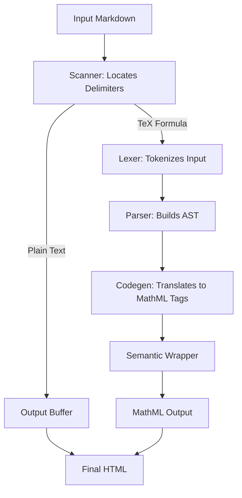
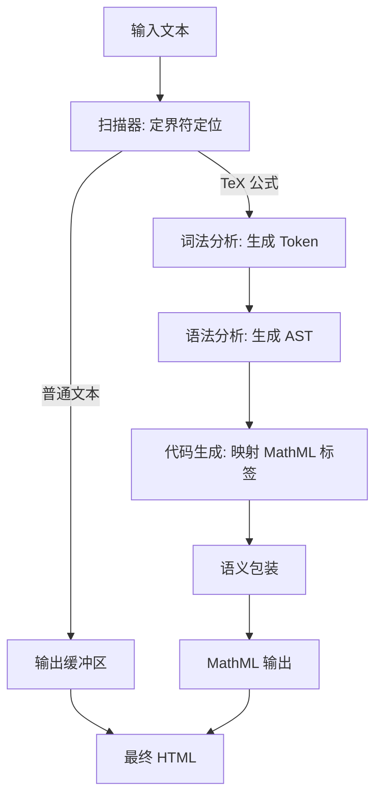

[English](#en) | [中文](#zh)

---

<a id="en"></a>

# @webc.site/math : The world's smallest and fastest web Markdown formula renderer

- [@webc.site/math : The world's smallest and fastest web Markdown formula renderer](#webcsitemath-the-worlds-smallest-and-fastest-web-markdown-formula-renderer)
  - [1. Features](#1-features)
  - [2. Usage](#2-usage)
    - [Compilation Examples](#compilation-examples)
      - [Render TeX Formulas Directly](#render-tex-formulas-directly)
      - [Replace Formulas in Markdown Text](#replace-formulas-in-markdown-text)
    - [Font and CSS Configuration](#font-and-css-configuration)
      - [CSS Font Styling](#css-font-styling)
  - [3. Plugins](#3-plugins)
    - [3.1 markdown-it](#31-markdown-it)
    - [3.2 marked](#32-marked)
    - [3.3 remark](#33-remark)
  - [4. Design](#4-design)
  - [5. Tech Stack](#5-tech-stack)
  - [6. Code Structure](#6-code-structure)
  - [7. Historical Background](#7-historical-background)

## 1. Features

This project compiles LaTeX math formulas into browser-native MathML Core markup. Through compile-time conversion, it bypasses client-side layout engines to achieve zero-overhead formula rendering.

Key Features:

- **High Performance**: Compiles TeX formulas directly to native MathML. Processing speed exceeds 300,000 operations per second, 3 times faster than KaTeX and 40 times faster than MathJax.
- **Lightweight**: Core package size is 7.69 KB (3.56 KB gzipped) with zero external dependencies.
- **Zero Runtime Overhead**: Relies entirely on the browser's native engine for layout, eliminating client-side JavaScript formatting libraries.
- **Robust Fault Tolerance**: Catches syntax errors (such as unclosed braces) and reverts to raw TeX string output to prevent application crashes.
- **High Compatibility**: Generates standard MathML tags suitable for Server-Side Rendering (SSR), Static Site Generation (SSG), and Client-Side Rendering (CSR).

## 2. Usage

### Compilation Examples

#### Render TeX Formulas Directly

```javascript
import mathml from "@webc.site/math";

// Second parameter set to true renders block style
const html = mathml("e^{i\\pi} + 1 = 0", true);
```

#### Replace Formulas in Markdown Text

```javascript
import mdMath from "@webc.site/math/md.js";
import compile from "@webc.site/math";

const html = mdMath("Euler's identity: $$e^{i\\pi} + 1 = 0$$", compile);
```

### Font and CSS Configuration

Configure math fonts to ensure proper layout alignment. Latin Modern Math font from the `18s` package is recommended.

#### CSS Font Styling

```css
math {
  font-family: m, t, math, sans-serif;
}
```

## 3. Plugins

This project provides extension plugins for mainstream Markdown parsers to render TeX formulas directly to MathML markup during compilation/building.

### 3.1 markdown-it

Installation:

```bash
npm install @webc.site/math-markdown-it
```

Usage:

```javascript
import markdownit from "markdown-it";
import mathMarkdownIt from "@webc.site/math-markdown-it";

const md = markdownit().use(mathMarkdownIt);

const html = md.render("Inline math: $E = mc^2$ and block math: \n$$\n\\frac{a}{b}\n$$");
console.log(html);
```

### 3.2 marked

Installation:

```bash
npm install @webc.site/math-marked
```

Usage:

```javascript
import { marked } from "marked";
import mathMarked from "@webc.site/math-marked";

marked.use(mathMarked());

const html = marked.parse("Inline math: $E = mc^2$ and block math: \n$$\n\\frac{a}{b}\n$$");
console.log(html);
```

### 3.3 remark

Installation:

```bash
npm install @webc.site/math-remark
```

Usage:

```javascript
import { unified } from "unified";
import remarkParse from "remark-parse";
import remarkMath from "remark-math";
import mathRemark from "@webc.site/math-remark";
import remarkHtml from "remark-html";

const processor = unified()
  .use(remarkParse)
  .use(remarkMath)
  .use(mathRemark)
  .use(remarkHtml, { sanitize: false });

const html = await processor.process(
  "Inline math: $E = mc^2$ and block math: \n$$\n\\frac{a}{b}\n$$",
);
console.log(String(html));
```

## 4. Design

The compiler extracts TeX formulas from input Markdown text, tokenizes and parses them, and translates the AST to semantic MathML markup.



## 5. Tech Stack

- **Build & Test Environment**: Bun, Node.js
- **Linter & Formatter**: oxlint, oxfmt
- **Build Tool**: Vite, Rolldown, Lightning CSS

## 6. Code Structure

```
.
├── demo/                # Interactive demo page
├── extract/             # Test cases extraction scripts
├── lib/                 # Compiled distribution files
│   ├── mathml.js        # Core compiler (minified)
│   └── md.js            # Markdown math formula parser (minified)
├── src/                 # Source code
│   ├── const/           # Tokens, AST types, symbols, and functions constants
│   ├── lex.js           # LaTeX lexer
│   ├── parse.js         # LaTeX parser (AST builder)
│   ├── mathml.js        # Core TeX-to-MathML compiler
│   └── md.js            # Markdown parser entry
├── sh/                  # Scripts
└── test.sh              # Quality verification and test runner
```

## 7. Historical Background

The W3C published the MathML 1.0 specification in 1998 to standardize mathematical notation on the web. However, the complexity of the specification placed a maintenance burden on browser layout engines.

In 2013, the Chromium team removed the unfinished MathML rendering implementation from the Blink engine due to maintenance costs and security vulnerabilities. Web developers subsequently relied on client-side JavaScript libraries (such as MathJax and KaTeX) to simulate formula layout. These libraries increased bundle sizes and consumed client-side CPU resources, impacting page load times and rendering performance.

To resolve this issue, organizations like Igalia and Mozilla refactored the specification into the MathML Core standard, focusing on essential, implementable parts backed by Web Platform Tests.

In January 2023, Chrome 109 reintroduced support for the MathML Core specification. With Blink, Gecko, and WebKit all natively supporting this subset, web browsers achieved consistent native MathML rendering. This project compiles TeX directly to native MathML markup at compile time, eliminating client-side layout engines and avoiding client-side rendering overhead.


---

<a id="zh"></a>
# @webc.site/math : 全球最小最快的网页 Markdown 公式渲染器

- [@webc.site/math : 全球最小最快的网页 Markdown 公式渲染器](#webcsitemath-全球最小最快的网页-markdown-公式渲染器)
  - [1. 功能介绍](#1-功能介绍)
  - [2. 使用演示](#2-使用演示)
    - [直接渲染 TeX 公式](#直接渲染-tex-公式)
    - [替换 Markdown 文本中的公式](#替换-markdown-文本中的公式)
    - [字体与 CSS 配置](#字体与-css-配置)
  - [3. 插件](#3-插件)
    - [3.1 markdown-it](#31-markdown-it)
    - [3.2 marked](#32-marked)
    - [3.3 remark](#33-remark)
  - [4. 设计思路](#4-设计思路)
  - [5. 技术栈](#5-技术栈)
  - [6. 代码结构](#6-代码结构)
  - [7. 历史故事](#7-历史故事)

## 1. 功能介绍

本项目将 LaTeX 数学公式编译为浏览器原生支持的 MathML Core 标记。通过编译期转换，无需客户端排版引擎，实现零运行时开销的公式渲染。

核心特性：

- **高性能**：TeX 公式直接转换为原生 MathML 标签，处理速度达每秒 300,000 次以上
- **轻量化**：核心包体积 7.69 KB（Gzip 压缩后 3.56 KB），无外部依赖
- **零运行开销**：完全依赖浏览器原生引擎排版与渲染
- **高容错性**：自动捕获语法错误，降级输出原始 TeX 字符串
- **强兼容性**：生成标准 MathML 标签，适配 SSR、SSG 和 CSR

## 2. 使用演示

### 直接渲染 TeX 公式

```javascript
import mathml from "@webc.site/math";

// 第二参数为 true 表示渲染为块级公式
const html = mathml("e^{i\\pi} + 1 = 0", true);
```

### 替换 Markdown 文本中的公式

```javascript
import mdMath from "@webc.site/math/md.js";
import compile from "@webc.site/math";

const html = mdMath("欧拉恒等式：$$e^{i\\pi} + 1 = 0$$", compile);
```

### 字体与 CSS 配置

配置数学字体确保排版对齐：

```css
math {
  font-family: m, t, math, sans-serif;
}
```

## 3. 插件

本项目为各大主流 Markdown 解析器提供了扩展插件，可在编译/构建时直接将 TeX 公式渲染为原生 MathML 标记。

### 3.1 markdown-it

安装：

```bash
npm install @webc.site/math-markdown-it
```

使用方法：

```javascript
import markdownit from "markdown-it";
import mathMarkdownIt from "@webc.site/math-markdown-it";

const md = markdownit().use(mathMarkdownIt);

const html = md.render("行内公式: $E = mc^2$ 和 块级公式: \n$$\n\\frac{a}{b}\n$$");
console.log(html);
```

### 3.2 marked

安装：

```bash
npm install @webc.site/math-marked
```

使用方法：

```javascript
import { marked } from "marked";
import mathMarked from "@webc.site/math-marked";

marked.use(mathMarked());

const html = marked.parse("行内公式: $E = mc^2$ 和 块级公式: \n$$\n\\frac{a}{b}\n$$");
console.log(html);
```

### 3.3 remark

安装：

```bash
npm install @webc.site/math-remark
```

使用方法：

```javascript
import { unified } from "unified";
import remarkParse from "remark-parse";
import remarkMath from "remark-math";
import mathRemark from "@webc.site/math-remark";
import remarkHtml from "remark-html";

const processor = unified()
  .use(remarkParse)
  .use(remarkMath)
  .use(mathRemark)
  .use(remarkHtml, { sanitize: false });

const html = await processor.process(
  "行内公式: $E = mc^2$ 和 块级公式: \n$$\n\\frac{a}{b}\n$$",
);
console.log(String(html));
```

## 4. 设计思路

编译器从输入文本中提取 TeX 公式，依次通过扫描、词法分析、语法分析，最终生成语义化 MathML 标记。



## 5. 技术栈

- **运行环境**：Node.js, Bun
- **构建工具**：Rolldown, Vite
- **样式处理**：Lightning CSS
- **代码质量**：oxlint, oxfmt

## 6. 代码结构

```
.
├── lib/                 # 编译产物目录
│   ├── mathml.js        # 核心编译器
│   └── md.js            # Markdown 公式解析器
├── src/                 # 源代码
│   ├── const/           # Token、AST 节点、符号和函数常量定义
│   ├── lex.js           # LaTeX 词法分析器
│   ├── parse.js         # LaTeX 语法分析器
│   ├── mathml.js        # TeX 至 MathML 核心编译器
│   └── md.js            # Markdown 公式解析入口
├── demo/                # 演示页面
├── extract/             # 测试用例提取脚本
└── sh/                  # 构建脚本
```

## 7. 历史故事

1998 年，W3C 发布 MathML 1.0 规范，旨在提供万维网数学公式的标准排版方案。由于早期规范复杂，给浏览器排版引擎带来维护负担。

2013 年，Chromium 团队因维护成本与安全漏洞考量，移除了 Blink 引擎中的 MathML 渲染代码。网页公式排版转为依赖第三方 JavaScript 库（如 MathJax、KaTeX）模拟公式布局。

2023 年 1 月，Chrome 109 重新支持 MathML Core 标准，Blink、Gecko 和 WebKit 三大主流浏览器引擎实现原生 MathML 渲染支持。本项目在此背景下开发，将 TeX 在构建期或服务端直接编译为原生 MathML 标记。
