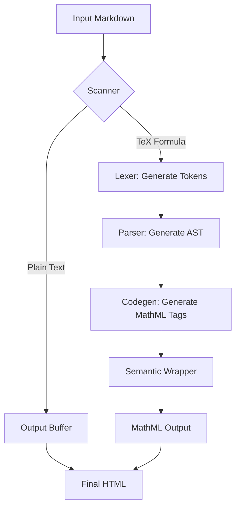

## Design and Workflow

The parser processes the input Markdown string, isolates TeX expressions, and translates them into MathML structures.

### Module Stages

1. **Scanner**: Scans the input string to locate formula delimiters (`$` and `$$`).
2. **Lexer**: Breaks the TeX string into tokens like numbers, variables, operators, and control commands.
3. **Parser**: Translates tokens into an Abstract Syntax Tree (AST), supporting operations like subscripts, superscripts, fractions, and built-in functions.
4. **Codegen**: Maps AST nodes to standard MathML Core elements (`<mi>`, `<mo>`, `<mn>`, `<mfrac>`, `<msup>`, `<msub>`, `<msubsup>`).
