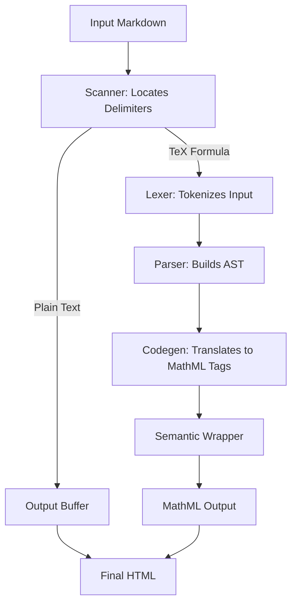

[](https://www.npmjs.com/package/@webc.site/math)
[](https://x.com/iwebcsite)
[](https://webc-site.bsky.social)

# @webc.site/math : The world's smallest and fastest web Markdown formula renderer

## 1. Features

This project compiles LaTeX math formulas into browser-native MathML Core markup. Through compile-time conversion, it bypasses client-side layout engines to achieve zero-overhead formula rendering.

Key Features:

- **High Performance**: Compiles TeX formulas directly to native MathML. Processing speed exceeds 300,000 operations per second, 3 times faster than KaTeX and 40 times faster than MathJax.
- **Lightweight**: Core package size is 8.95 KB (4.62 KB gzipped) with zero external dependencies.
- **Zero Runtime Overhead**: Relies entirely on the browser's native engine for layout, eliminating client-side JavaScript formatting libraries.
- **Robust Fault Tolerance**: Catches syntax errors (such as unclosed braces) and reverts to raw TeX string output to prevent application crashes.
- **High Compatibility**: Generates standard MathML tags suitable for Server-Side Rendering (SSR), Static Site Generation (SSG), and Client-Side Rendering (CSR).

## 2. Usage

### Compilation Examples

#### Render TeX Formulas Directly

```javascript
import mathml from "@webc.site/math";

// Second parameter set to true renders block style
const html = mathml("e^{i\\pi} + 1 = 0", true);
```

#### Replace Formulas in Markdown Text

```javascript
import mdMath from "@webc.site/math/md.js";
import compile from "@webc.site/math";

const html = mdMath("Euler's identity: $$e^{i\\pi} + 1 = 0$$", compile);
```

### Font and CSS Configuration

MathML layout relies on OpenType Math fonts containing dedicated mathematical metrics (the `MATH` table) to correctly handle radical scaling, delimiter stretching (e.g., parentheses, braces), fraction line thickness, and sub/superscript alignments.

The classic TeX math font **Latin Modern Math** (derived from Donald Knuth's Computer Modern family) is recommended.

#### Importing the Math Font

##### Option 1: Via CDN (Recommended)

Import the Latin Modern Math font stylesheet from the `18s` font package (which registers the font family name as `m`):

In CSS:

```css
@import url("https://registry.npmmirror.com/18s/0.2.24/files/m.css");
```

Or in HTML `<head>`:

```html
<link rel="stylesheet" href="https://registry.npmmirror.com/18s/0.2.24/files/m.css" />
```

To include the body text font (`t`) and monospace code font (`c`) along with the math font, import the complete stylesheet:

```html
<link rel="stylesheet" href="https://registry.npmmirror.com/18s/0.2.24/files/_.css" />
```

##### Option 2: Self-hosting Font Files

Download the Latin Modern Math WOFF2 font file and declare `@font-face`:

```css
@font-face {
  font-family: "Latin Modern Math";
  src: url("/fonts/latinmodern-math.woff2") format("woff2");
  font-style: normal;
  font-display: swap;
}
```

#### CSS Styling Configuration

##### Font Family Fallback Chain

Declare the font stack and inherit text color for `<math>` elements:

```css
math {
  font-family: m, "Latin Modern Math", "Cambria Math", math, sans-serif;
  color: inherit;
}
```

- `m`: Latin Modern Math declared via `m.css`
- `"Latin Modern Math"`: Self-hosted or system-installed Latin Modern Math
- `"Cambria Math"`: Built-in Windows system math font
- `math`: W3C CSS Fonts generic math font family keyword (natively supported in modern browsers)
- `sans-serif`: Final sans-serif fallback

##### Block Formula Layout Optimization

Compiled block formulas contain the `display="block"` attribute. To prevent wide formulas from overflowing containers on mobile or narrow screens, configure horizontal scrolling and centering:

```css
math[display="block"] {
  display: block;
  max-width: 100%;
  overflow-x: auto;
  overflow-y: hidden;
  margin: 1em auto;
  padding: 0.5em 0;
  text-align: center;
}
```

## 3. Plugins

This project provides extension plugins for mainstream Markdown parsers to render TeX formulas directly to MathML markup during compilation/building.

### 3.1 markdown-it

Installation:

```bash
npm install @webc.site/math-markdown-it
```

Usage:

```javascript
import markdownit from "markdown-it";
import mathMarkdownIt from "@webc.site/math-markdown-it";

const md = markdownit().use(mathMarkdownIt);

const html = md.render("Inline math: $E = mc^2$ and block math: \n$$\n\\frac{a}{b}\n$$");
console.log(html);
```

### 3.2 marked

Installation:

```bash
npm install @webc.site/math-marked
```

Usage:

```javascript
import { marked } from "marked";
import mathMarked from "@webc.site/math-marked";

marked.use(mathMarked());

const html = marked.parse("Inline math: $E = mc^2$ and block math: \n$$\n\\frac{a}{b}\n$$");
console.log(html);
```

### 3.3 remark

Installation:

```bash
npm install @webc.site/math-remark
```

Usage:

```javascript
import { unified } from "unified";
import remarkParse from "remark-parse";
import remarkMath from "remark-math";
import mathRemark from "@webc.site/math-remark";
import remarkHtml from "remark-html";

const processor = unified()
  .use(remarkParse)
  .use(remarkMath)
  .use(mathRemark)
  .use(remarkHtml, { sanitize: false });

const html = await processor.process(
  "Inline math: $E = mc^2$ and block math: \n$$\n\\frac{a}{b}\n$$",
);
console.log(String(html));
```

## 4. Design

The compiler extracts TeX formulas from input Markdown text, tokenizes and parses them, and translates the AST to semantic MathML markup.



## 5. Tech Stack

- **Build & Test Environment**: Bun, Node.js
- **Linter & Formatter**: oxlint, oxfmt
- **Build Tool**: Vite, Rolldown, Lightning CSS

## 6. Code Structure

```
.
├── demo/                # Interactive demo page
├── extract/             # Test cases extraction scripts
├── lib/                 # Compiled distribution files
│   ├── mathml.js        # Core compiler (minified)
│   └── md.js            # Markdown math formula parser (minified)
├── src/                 # Source code
│   ├── const/           # Tokens, AST types, symbols, and functions constants
│   ├── lex.js           # LaTeX lexer
│   ├── parse.js         # LaTeX parser (AST builder)
│   ├── mathml.js        # Core TeX-to-MathML compiler
│   └── md.js            # Markdown parser entry
├── sh/                  # Scripts
└── test.sh              # Quality verification and test runner
```

## 7. Historical Background

The W3C published the MathML 1.0 specification in 1998 to standardize mathematical notation on the web. However, the complexity of the specification placed a maintenance burden on browser layout engines.

In 2013, the Chromium team removed the unfinished MathML rendering implementation from the Blink engine due to maintenance costs and security vulnerabilities. Web developers subsequently relied on client-side JavaScript libraries (such as MathJax and KaTeX) to simulate formula layout. These libraries increased bundle sizes and consumed client-side CPU resources, impacting page load times and rendering performance.

To resolve this issue, organizations like Igalia and Mozilla refactored the specification into the MathML Core standard, focusing on essential, implementable parts backed by Web Platform Tests.

In January 2023, Chrome 109 reintroduced support for the MathML Core specification. With Blink, Gecko, and WebKit all natively supporting this subset, web browsers achieved consistent native MathML rendering. This project compiles TeX directly to native MathML markup at compile time, eliminating client-side layout engines and avoiding client-side rendering overhead.
