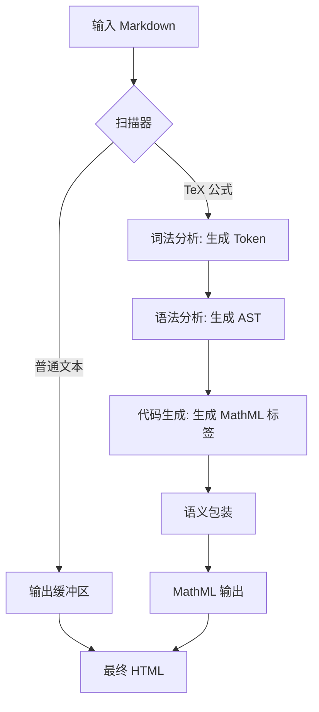

## 设计思路与调用流程

解析器处理输入的 Markdown 字符串，隔离 TeX 表达式，并将其转换为 MathML 结构。

### 模块运行流程

1. **扫描器**：扫描输入字符串，定位公式定界符（`$` 和 `$$`）。
2. **词法分析**：将 TeX 字符串分解为数字、变量、运算符和控制命令等 Token。
3. **语法分析**：将 Token 转换为抽象语法树（AST）节点，支持分式、上下标及预设数学函数。
4. **代码生成**：将 AST 节点映射为标准 XML 节点（`<mi>`、`<mo>`、`<mn>`、`<mfrac>`、`<msup>`、`<msub>`、`<msubsup>`）。
