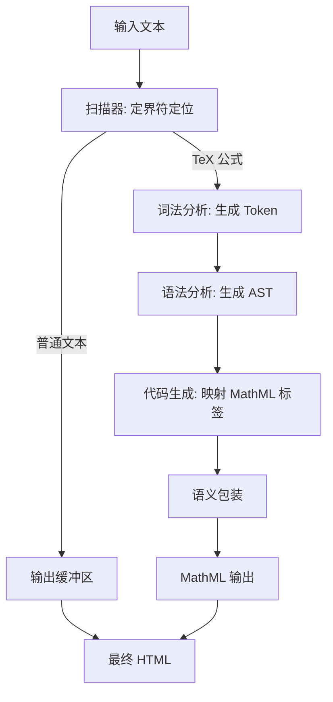

# @webc.site/math : 全球最小最快的网页 Markdown 公式渲染器

## 1. 功能介绍

本项目将 LaTeX 数学公式编译为浏览器原生支持的 MathML Core 标记。通过编译期转换，无需客户端排版引擎，实现零运行时开销的公式渲染。

核心特性：

- **高性能**：TeX 公式直接转换为原生 MathML 标签，处理速度达每秒 300,000 次以上
- **轻量化**：核心包体积 9.14 KB（Gzip 压缩后 4.62 KB），无外部依赖
- **零运行开销**：完全依赖浏览器原生引擎排版与渲染
- **高容错性**：自动捕获语法错误，降级输出原始 TeX 字符串
- **强兼容性**：生成标准 MathML 标签，适配 SSR、SSG 和 CSR

## 2. 使用演示

### 直接渲染 TeX 公式

```javascript
import mathml from "@webc.site/math";

// 第二参数为 true 表示渲染为块级公式
const html = mathml("e^{i\\pi} + 1 = 0", true);
```

### 替换 Markdown 文本中的公式

```javascript
import mdMath from "@webc.site/math/md.js";
import compile from "@webc.site/math";

const html = mdMath("欧拉恒等式：$$e^{i\\pi} + 1 = 0$$", compile);
```

### 字体与 CSS 配置

浏览器排版 MathML 依赖包含数学排版度量（OpenType Math 表）的数学字体，用于呈现根号伸缩、大括号拉伸、分式厚度与上下标对齐。

推荐使用 TeX 经典数学字体 **Latin Modern Math**（源自 Computer Modern 字体家族）。

#### 引入数学字体

##### 方式一：CDN 在线引用（推荐）

通过 `18s` 字体包在线引入 Latin Modern Math 样式（该样式将 Latin Modern Math 声明为字体族 `m`）：

在 CSS 中引入：

```css
@import url("https://registry.npmmirror.com/18s/0.2.24/files/m.css");
```

或在 HTML `<head>` 中引入：

```html
<link rel="stylesheet" href="https://registry.npmmirror.com/18s/0.2.24/files/m.css" />
```

若同时需要页面正文字体（`t`）与代码等宽字体（`c`），可直接引用完整样式表：

```html
<link rel="stylesheet" href="https://registry.npmmirror.com/18s/0.2.24/files/_.css" />
```

##### 方式二：本地托管字体文件

下载 Latin Modern Math 字体文件（WOFF2 格式），通过 `@font-face` 声明：

```css
@font-face {
  font-family: "Latin Modern Math";
  src: url("/fonts/latinmodern-math.woff2") format("woff2");
  font-style: normal;
  font-display: swap;
}
```

#### CSS 样式配置

##### 字体族声明与回退链

为 `<math>` 标签配置字体族与继承颜色：

```css
math {
  font-family: m, "Latin Modern Math", "Cambria Math", math, sans-serif;
  color: inherit;
}
```

- `m`：`m.css` 声明的 Latin Modern Math 网页字体
- `"Latin Modern Math"`：本地托管或系统安装的 Latin Modern Math 字体
- `"Cambria Math"`：Windows 系统内置数学字体
- `math`：CSS Fonts 规范定义的数学通用字体族关键字（现代主流浏览器原生支持）
- `sans-serif`：无衬线回退字体

##### 块级公式排版优化

块级公式编译后带有 `display="block"` 属性。为防止长公式超出容器或在移动端撑破页面，推荐配置横向滚动与居中样式：

```css
math[display="block"] {
  display: block;
  max-width: 100%;
  overflow-x: auto;
  overflow-y: hidden;
  margin: 1em auto;
  padding: 0.5em 0;
  text-align: center;
}
```

## 3. 插件

本项目为各大主流 Markdown 解析器提供了扩展插件，可在编译/构建时直接将 TeX 公式渲染为原生 MathML 标记。

### 3.1 markdown-it

安装：

```bash
npm install @webc.site/math-markdown-it
```

使用方法：

```javascript
import markdownit from "markdown-it";
import mathMarkdownIt from "@webc.site/math-markdown-it";

const md = markdownit().use(mathMarkdownIt);

const html = md.render("行内公式: $E = mc^2$ 和 块级公式: \n$$\n\\frac{a}{b}\n$$");
console.log(html);
```

### 3.2 marked

安装：

```bash
npm install @webc.site/math-marked
```

使用方法：

```javascript
import { marked } from "marked";
import mathMarked from "@webc.site/math-marked";

marked.use(mathMarked());

const html = marked.parse("行内公式: $E = mc^2$ 和 块级公式: \n$$\n\\frac{a}{b}\n$$");
console.log(html);
```

### 3.3 remark

安装：

```bash
npm install @webc.site/math-remark
```

使用方法：

```javascript
import { unified } from "unified";
import remarkParse from "remark-parse";
import remarkMath from "remark-math";
import mathRemark from "@webc.site/math-remark";
import remarkHtml from "remark-html";

const processor = unified()
  .use(remarkParse)
  .use(remarkMath)
  .use(mathRemark)
  .use(remarkHtml, { sanitize: false });

const html = await processor.process("行内公式: $E = mc^2$ 和 块级公式: \n$$\n\\frac{a}{b}\n$$");
console.log(String(html));
```

## 4. 设计思路

编译器从输入文本中提取 TeX 公式，依次通过扫描、词法分析、语法分析，最终生成语义化 MathML 标记。



## 5. 技术栈

- **运行环境**：Node.js, Bun
- **构建工具**：Rolldown, Vite
- **样式处理**：Lightning CSS
- **代码质量**：oxlint, oxfmt

## 6. 代码结构

```
.
├── lib/                 # 编译产物目录
│   ├── mathml.js        # 核心编译器
│   └── md.js            # Markdown 公式解析器
├── src/                 # 源代码
│   ├── const/           # Token、AST 节点、符号和函数常量定义
│   ├── lex.js           # LaTeX 词法分析器
│   ├── parse.js         # LaTeX 语法分析器
│   ├── mathml.js        # TeX 至 MathML 核心编译器
│   └── md.js            # Markdown 公式解析入口
├── demo/                # 演示页面
├── extract/             # 测试用例提取脚本
└── sh/                  # 构建脚本
```

## 7. 历史故事

1998 年，W3C 发布 MathML 1.0 规范，旨在提供万维网数学公式的标准排版方案。由于早期规范复杂，给浏览器排版引擎带来维护负担。

2013 年，Chromium 团队因维护成本与安全漏洞考量，移除了 Blink 引擎中的 MathML 渲染代码。网页公式排版转为依赖第三方 JavaScript 库（如 MathJax、KaTeX）模拟公式布局。

2023 年 1 月，Chrome 109 重新支持 MathML Core 标准，Blink、Gecko 和 WebKit 三大主流浏览器引擎实现原生 MathML 渲染支持。本项目在此背景下开发，将 TeX 在构建期或服务端直接编译为原生 MathML 标记。
